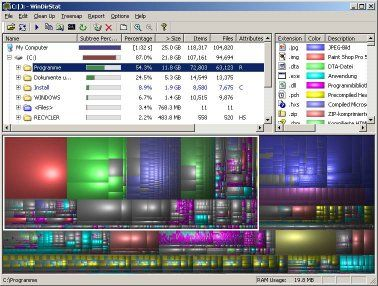

Wondering what's eating up all of your disk space?  Load up WinDirStat and
you'll see a map of your harddrive.  You can now quickly dig down and figure out
what the problem is.  Typically it's that you should have sprung for the larger
hard drive in the first place, because there's no way you'll want to delete all
of those sweet vacation pics.

